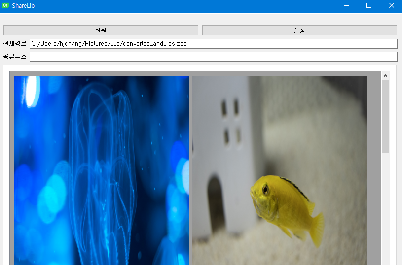

# ShareLib
Preview image in multiple zip files and share them by ftp

## Done
Viewing image in zip files & view them by external image viewer program
 * Only jpg, png supported. 

## Working on
ftp function

## What I used
Used Quazip & zlib library
Default image viewer program is [Honeyview](https://en.bandisoft.com/honeyview/)

